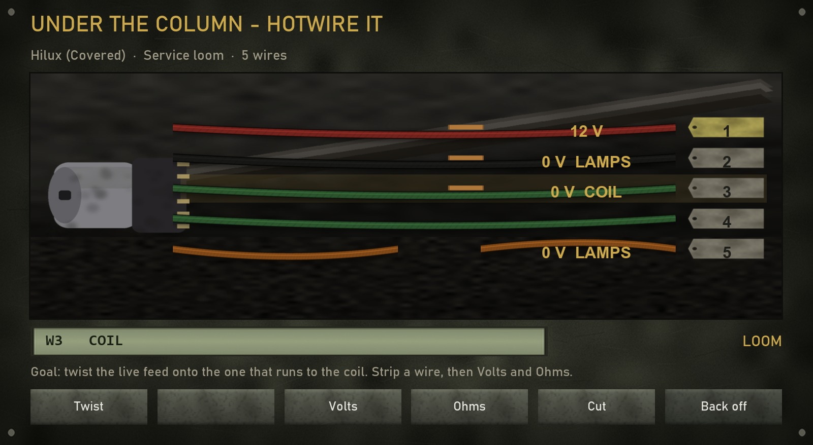
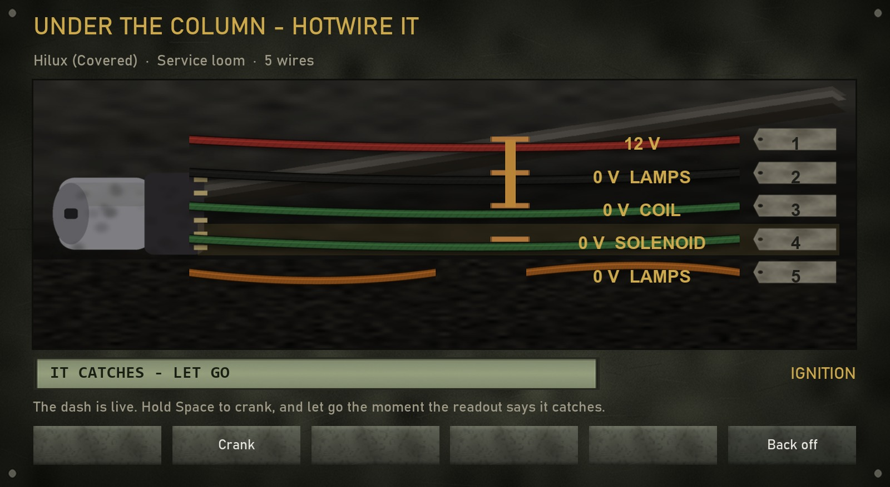

  

<h1 align="center">TLB Interactions</h1>

  Hands-on defusal and lockpicking for Arma 3 with ACE3. 
  <strong>No more progress bars.</strong>

  <a href="https://steamcommunity.com/sharedfiles/filedetails/?id=3801718055"><strong>Steam Workshop</strong></a> ·
  <a href="https://github.com/TLB-MilSim/TLB-Interactions/releases/latest"><strong>Download</strong></a> ·
  <a href="docs/defusal.md">Defusal guide</a> ·
  <a href="docs/lockpicking.md">Lockpicking &amp; doors</a> ·
  <a href="docs/vehicles.md">Vehicles</a> ·
  <a href="docs/modules.md">Modules</a> ·
  <a href="docs/settings.md">All settings</a> ·
  <a href="CHANGELOG.md">Changelog</a>

  

---

## What's new in 1.2.0

- **Vehicle locks on the board:** a locked vehicle is picked with a kit or a
  paperclip, in place of ACE's Lockpick progress bar.
- **Hotwiring:** a vehicle that was locked does not start without its key. Under
  the steering column there is a shroud to unscrew and a loom to read with a
  meter, and the wrong pair twisted together blows a fuse or sets the horn off.
- **TLB Keys handover:** with [TLB Keys](https://github.com/TLB-MilSim/TLB-Keys)
  loaded, one setting decides which mod owns vehicle picking and hotwiring.
- **Cheaper door lock scanning**, thanks to a contribution from
  [@RicGonzalezb](https://github.com/RicGonzalezb).

See the [changelog](CHANGELOG.md) for details, and [Vehicles](docs/vehicles.md)
for the full walkthrough.

## What it is

TLB Interactions turns two of ACE's waiting-for-a-bar moments into things you
actually do, and can get wrong.

**Defusal.** Using ACE's *Defuse* action no longer runs a timer. It opens a
board showing the device in front of you, and what you do depends on what it is:

| Device | What you do |
| --- | --- |
| **IED**: wired devices, and anything remote, timed, magnetic or IR | Brush the soil off, cut away the tape, find the firing line with a meter (volts and continuity), cut it. |
| **Mine**: pressure and proximity mines, AP and AT | Prod the soil to find it, dig out the rim without touching the pressure plate, seat the safety pin with a steady hand. |
| **Tripwire**: tripwire mines and flares | Part the grass to trace the whole wire (it may branch to a second device), check the tension, pin, cut. |

It replaces ACE's defusal rather than adding new explosives, so it works on
**every** mine and explosive ACE can already defuse: vanilla, ACE, RHS, CUP,
mission-placed or Zeus-placed.

**Vehicles.** A locked vehicle is picked on the same board, and getting in is
only half of it: a vehicle that was locked does not start without its key. Under
the steering column there is a shroud to unscrew and a loom to read with a meter,
and the wrong pair twisted together blows a fuse or sets the horn off. Full
walkthrough: [Vehicles](docs/vehicles.md).

**Lockpicking.** Locked doors are picked on a board with a **lock pick kit** or a
**paperclip**. Each lock rolls one of three techniques (pin tumbler, rake or
sweet spot), and a paperclip bends with every mistake and snaps on the third.
Doors always work: with **tsp_breach** loaded its door system is used; without
it, TLB Interactions runs its own door menu and random door locking.

**Mission makers and Zeus.** *Explosive settings* and *Lock settings* modules
change how the explosives and doors in one area behave in Eden, or configure a
single explosive or door in a live mission from Zeus.

Everything else is configurable through CBA settings, down to separate
difficulty levels for each lockpicking technique with each tool, and every key
can be rebound.

## Screenshots

**Before and after.** ACE's progress bar, and the board that replaces it.

| Before: ACE's progress bar | After: the device in front of you |
| --- | --- |
|  |  |

**IED**, from buried to tested

| 1. Buried | 2. Soil cleared, tape on | 3. Every conductor tested |
| --- | --- | --- |
|  |  |  |

**Mine and tripwire**, before and after

| Before | After |
| --- | --- |
|  |  |
|  |  |

**Lockpicking**

| Pin tumbler, lock pick kit | Rake, paperclip | Sweet spot, paperclip |
| --- | --- | --- |
|  |  |  |

**Vehicles**: the hotwire board, and the engine catching

| Reading the loom | Cranking it |
| --- | --- |
|  |  |

**Modules**, in Eden and Zeus

| Eden: Explosive settings | Zeus: context menu | Zeus: Lock settings |
| --- | --- | --- |
|  |  |  |

Board images are rendered from the mod's own textures and board layout. Module images are in-game screenshots.

## Requirements

| | |
| --- | --- |
| Arma 3 | v2.14 or newer |
| [CBA_A3](https://steamcommunity.com/workshop/filedetails/?id=450814997) | required |
| [ACE3](https://steamcommunity.com/workshop/filedetails/?id=463939057) | required |
| [Breach - Rewrite](https://steamcommunity.com/sharedfiles/filedetails/?id=3283645995) (tsp_breach) | optional. Its door actions, locking and items are used when loaded |
| [TLB Keys](https://github.com/TLB-MilSim/TLB-Keys) | optional. Its vehicle keys are used, and it hands vehicle picking and hotwiring to this mod |
| [Zeus Enhanced](https://steamcommunity.com/workshop/filedetails/?id=1779063631) | optional. Needed for the Zeus modules and context menu entries |

## Installation

1. Subscribe on the [Steam Workshop](https://steamcommunity.com/sharedfiles/filedetails/?id=3801718055),
   or download the signed build from the [latest release](https://github.com/TLB-MilSim/TLB-Interactions/releases/latest).
2. Load it together with CBA_A3 and ACE3.
3. On a server, load it on the server **and** every client. All settings are
   server-forced, and the boards run on the client.
4. For servers that verify signatures, copy `keys/TLBInteractions01.bikey` into
   the server's `keys` folder.

## Quick start

**Defusing:** walk up to an explosive with ACE's defusal kit and use *Defuse* as
usual. Read the board's title (**IED**, **Mine** or **Tripwire**) and follow
that procedure. Everything you finish stays done on the device, so you can back
off and come back, or hand it to a team mate. Full walkthrough:
[Defusal guide](docs/defusal.md).

**Picking a lock:** carry a lock pick kit or a paperclip, open the ACE
interaction menu at a locked door and choose *Pick lock* (or tsp_breach's *Use
Lockpick* / *Use Paperclip*). Default controls on the board: <kbd>A</kbd>/<kbd>D</kbd>
to move, hold <kbd>Space</kbd>, <kbd>R</kbd> to rake, <kbd>Esc</kbd> to back away.
Full walkthrough: [Lockpicking & doors](docs/lockpicking.md).

**Mission making:** place *Explosive settings* or *Lock settings* from **Systems
(F5) → Modules → TLB Interactions** in Eden, or point at an explosive or door in
Zeus and open the context menu. See [Modules](docs/modules.md).

**Configuring:** settings are under *Options → Addon Options → TLB Interactions*,
keys under *Options → Controls → Configure Addons → TLB Interactions*. Every
setting, its default and its range: [All settings](docs/settings.md).

## Documentation

| Page | For |
| --- | --- |
| [Defusal guide](docs/defusal.md) | Players: every stage of the IED, mine and tripwire procedures, what the readings mean, what kills you. |
| [Lockpicking & doors](docs/lockpicking.md) | Players: tools, the three techniques, door classes, the door menu without tsp_breach. |
| [Vehicles](docs/vehicles.md) | Players: picking vehicle locks, the ignition lock, the hotwire board and what shorts out. |
| [Modules](docs/modules.md) | Mission makers: Eden modules for an area and Zeus modules for one explosive or door. |
| [All settings](docs/settings.md) | Mission makers and server admins: every CBA setting and keybind with its default, range and effect, and the difficulty tables. |
| [Changelog](CHANGELOG.md) | Everyone: what changed in each version. |
| [How it works](docs/how-it-works.md) | Developers: how ACE is hooked, how devices and locks are generated, synced and drawn, how tsp_breach is taken over. |

## Compatibility

- Hooks ACE's own defuse interaction and keeps its name, icon, condition and
  distance. `ace_explosives_defuseStart` fires when a board opens and a correct
  cut ends in ACE's own defusal, so anything listening to ACE's events keeps
  working.
- AI defusing on their own, and the mod switched off in its settings, use ACE's
  original behaviour.
- **[Breach - Rewrite](https://steamcommunity.com/sharedfiles/filedetails/?id=3283645995) (tsp_breach):** detected automatically. Its door actions and locking stay in
  charge, and its lockpicking opens this board. Without it, the built-in door
  system takes over. The two never run at the same time.
- **[Zeus Enhanced](https://steamcommunity.com/workshop/filedetails/?id=1779063631):**
  detected automatically. Without it, only the Zeus modules and context menu
  entries are missing.
- Lock state uses the vanilla `bis_disabled_Door_N` variables, so missions and
  other scripts that lock doors work with it.

## Licence

TLB Interactions is licensed under the
**[Arma Public License No Derivatives (APL-ND)](https://www.bohemia.net/community/licenses/arma-public-license-nd)**.
You may share it unmodified, for non-commercial use, with attribution; you may not
modify it or publish derivative works. See [`LICENSE`](LICENSE).

## Credits

Made by **TLB MilSim**. All code, textures and icons are original work; textures
are generated by the scripts in `tools/`. ACE3, CBA_A3 and Zeus Enhanced are used
through their public APIs only, and no code or assets from other mods are
included.

Inspired by [IEDD Notebook](https://steamcommunity.com/sharedfiles/filedetails/?id=3048818056) and [Advanced IED System](https://steamcommunity.com/sharedfiles/filedetails/?id=2954190544),
which showed how much more fun hands-on IED work is than a progress bar. No code
or assets from either mod are used.
